# 一、系统说明

基于springboot+vue+elementui开发的铁路订票管理系统,系统功能齐全, 代码简洁易懂，适合小白学编程。

# 二、系统架构

######      前端：vue| elementui

######      后端：springboot | mybatis 

######      环境：jdk1.8+ | mysql8.0+ | maven

# 三、代码及数据库

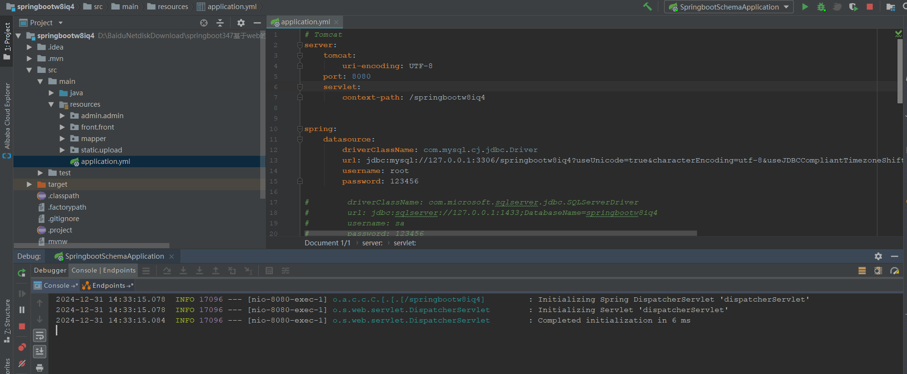

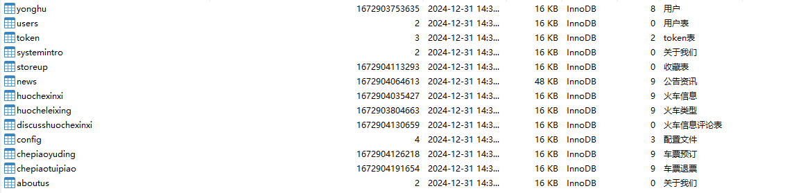

# 四、相关功能介绍

#### 1).客户端

###### 1.登录

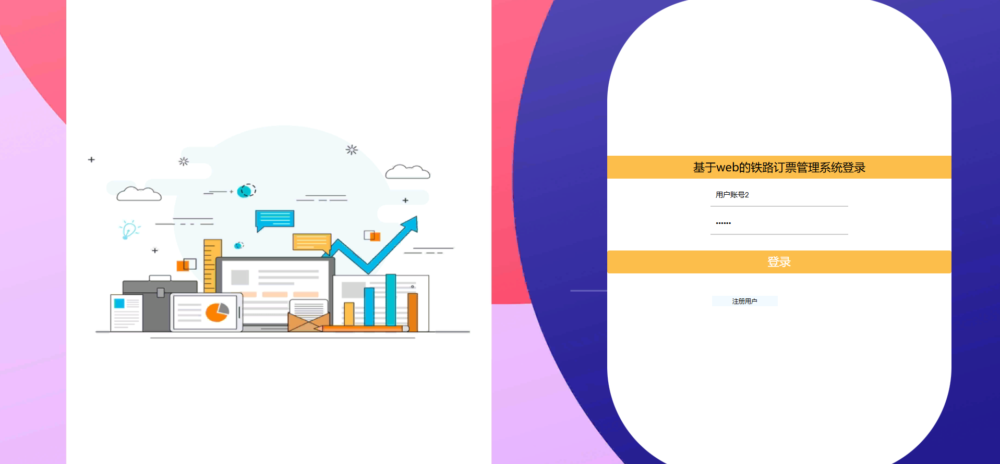

###### 2.注册

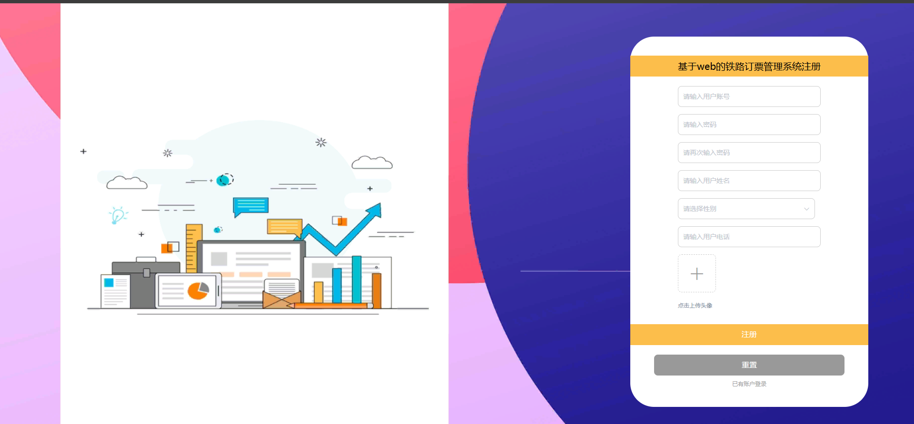

###### 3.首页

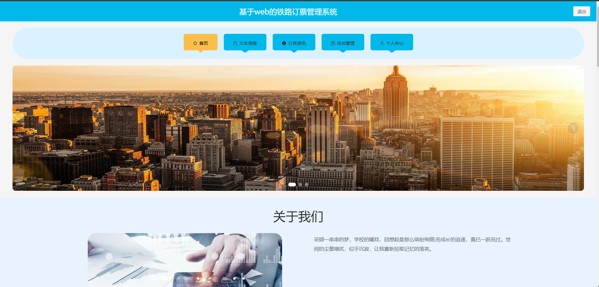

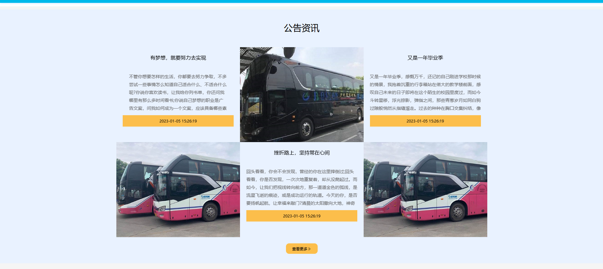

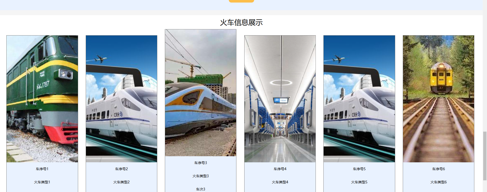

###### 4.火车信息

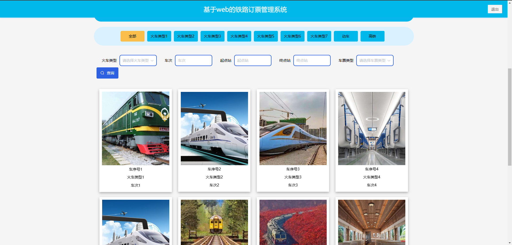

###### 5.车票预定

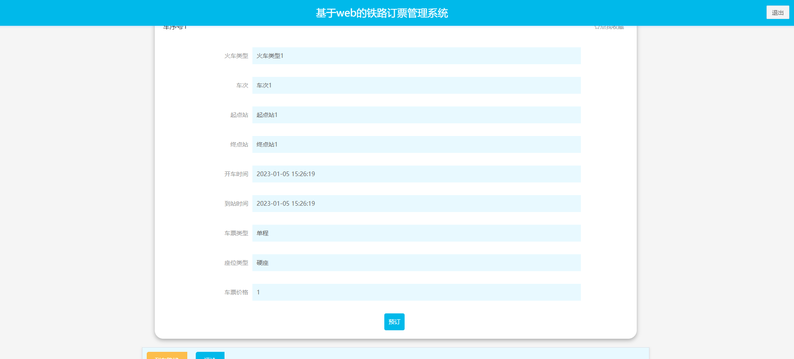

###### 6.公告资讯

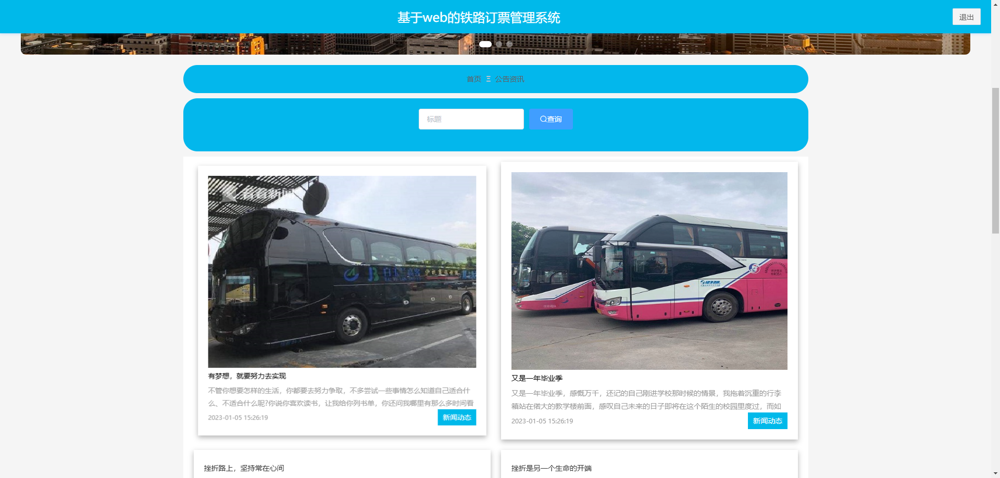

###### 7.个人中心

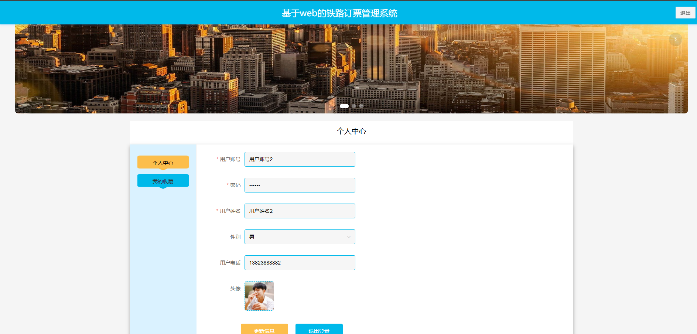

###### 8.车票预定

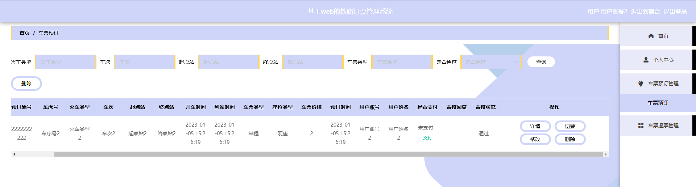

###### 9.车票退款

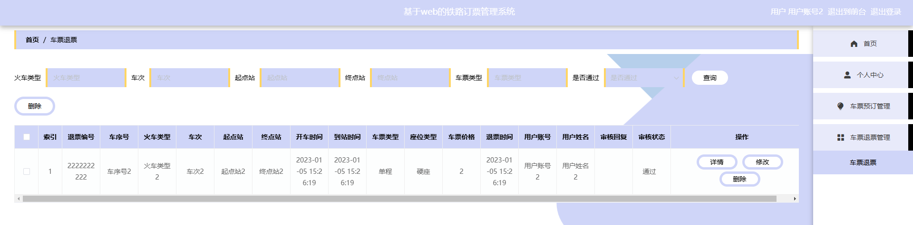

#### 2).管理端

###### 1.登录

###### 2.个人中心->修改密码

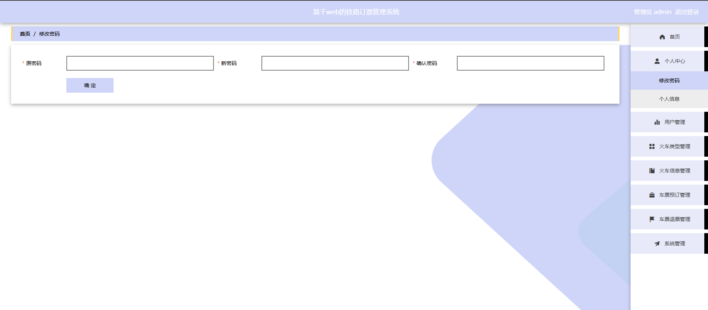

###### 3.用户管理

包含:删除、修改、新增、详情功能

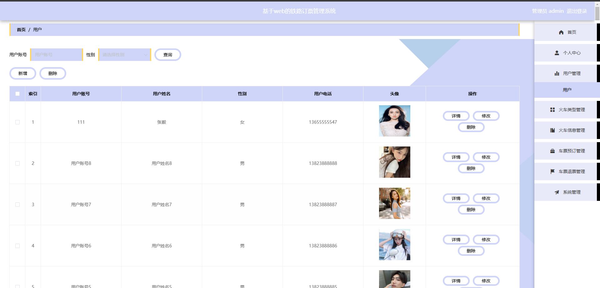

###### 3.火车类型管理

包含:删除、修改、新增功能

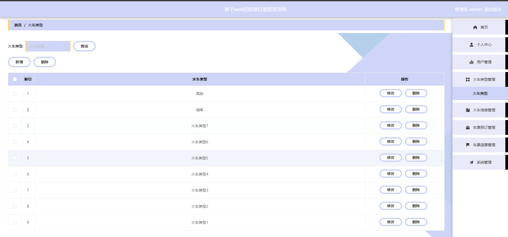

###### 4.火车信息

包含:删除、修改、新增、详情、评论回复功能

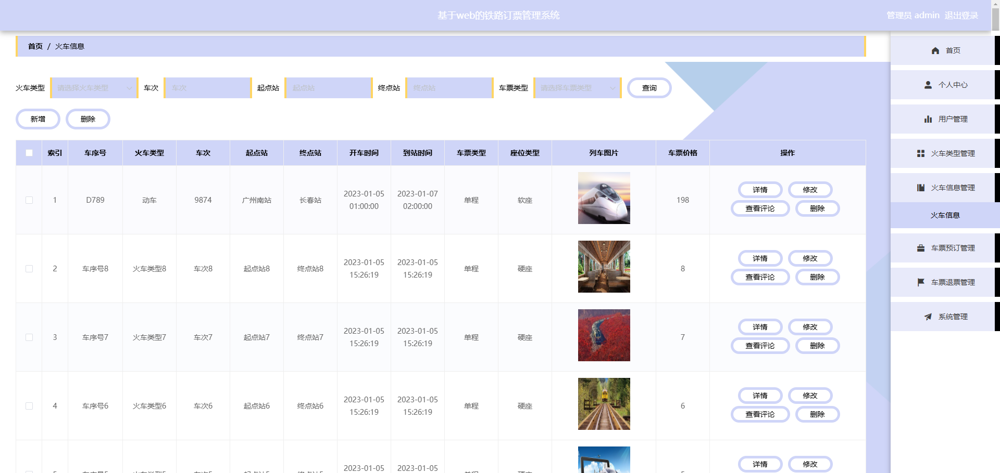

###### 5.车票预定

包含:删除、详情、修改功能

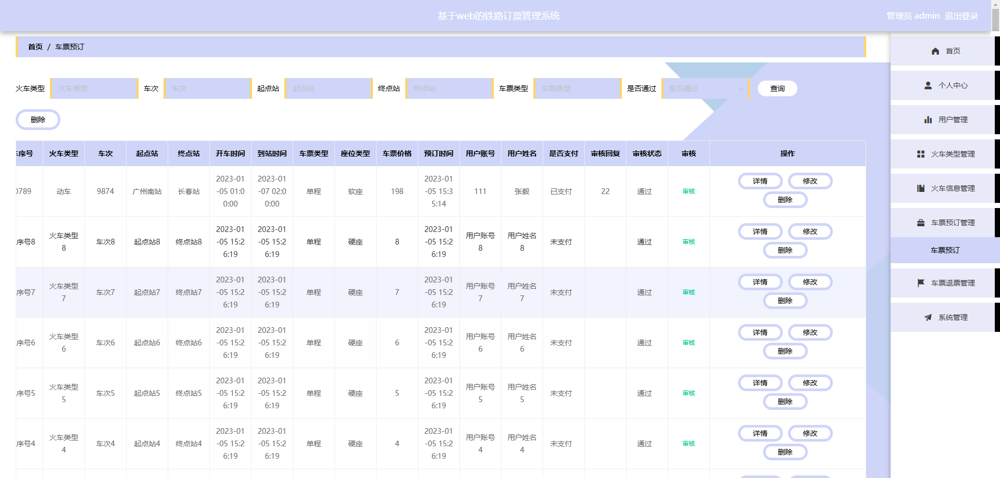

###### 6.退票管理

包含:删除、详情、修改、审核功能

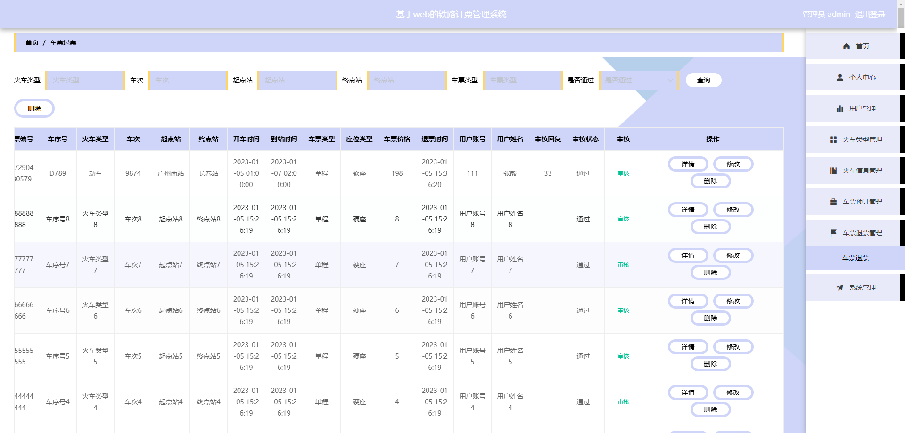

###### 7.系统管理

包含:公告资讯、关于我们、系统简介、轮播图管理

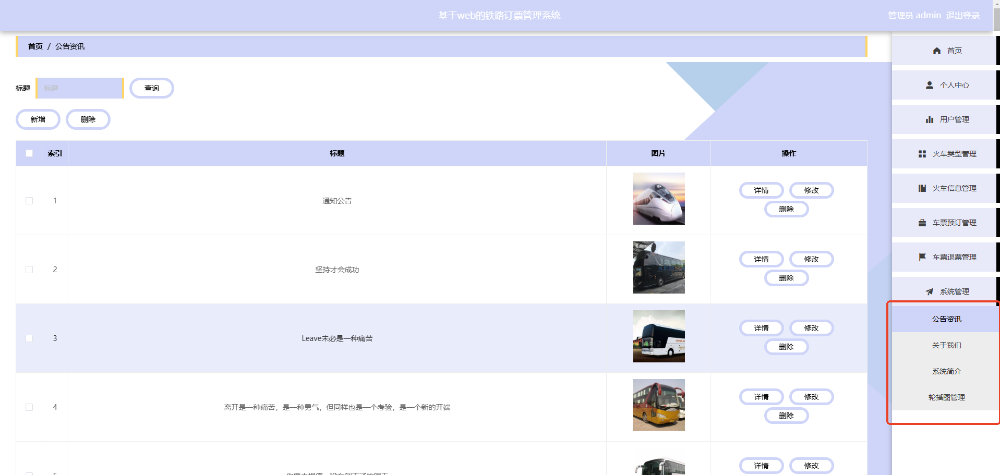

######

######
